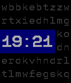

# Bad Selection [^1]
 

 

My entry for [Rebble Hackathon#002](https://rebble.io/hackathon-002/)

---

The font Feature Mono is made by 

---
**WARNING** the code inside this repo is a bit of a mess. 

With this watchface, I wanted to recreate the look of the old mechanical flipboards. Unfortunately, due to lack of IRL time and poor planning from my side, this project is very much underbaked. The watchface in its current form works, but it's fairly featureless.

Well, I guess if I was a good salesman I could say that this watchface is designed for battery saving.

Current TODOs:

- Clean up the code.
- Embed the current date in the text grid
- Add customization options.

--- 
[^1]: I'm bad at names.